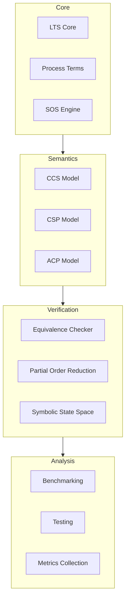
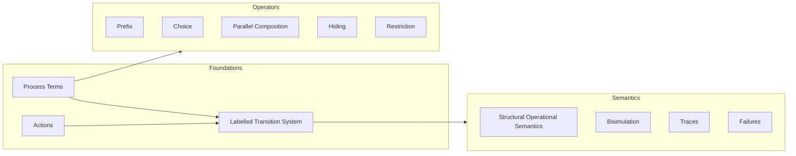
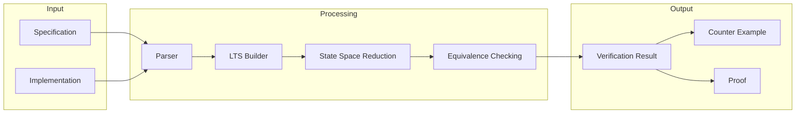
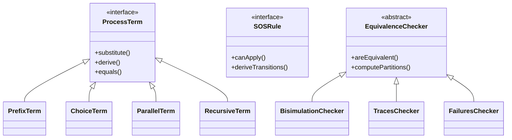
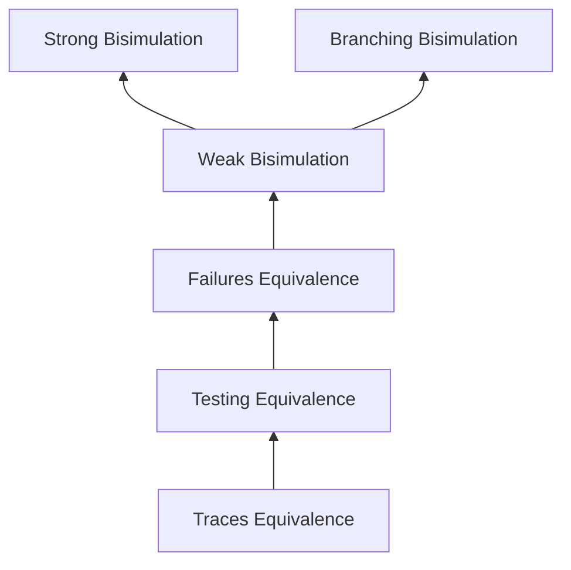

# Process Algebra Verifier

A TypeScript implementation of process algebra verification tools supporting CCS, CSP, and ACP semantics.

## Architecture



## Process Algebra Concepts



## Verification Pipeline



## Class Hierarchy



## Behavioral Equivalences Hierarchy



## Features

- Support for CCS, CSP, and ACP semantic models
- Multiple behavioral equivalence checking algorithms
- State space reduction techniques
- Symbolic state space representation
- Comprehensive testing and benchmarking tools

## Implementation Status

- [x] Core LTS infrastructure
- [x] Basic process terms
- [x] SOS engine
- [x] CCS semantics
- [ ] CSP semantics
- [ ] ACP semantics
- [x] Strong bisimulation
- [x] Weak bisimulation
- [ ] Testing equivalence
- [ ] Failures equivalence
- [x] Partial order reduction
- [ ] Symbolic state space
- [x] Basic testing framework
- [ ] Performance benchmarks

## Development

### Prerequisites

- Node.js >= 14
- TypeScript >= 4.5

### Setup

```bash
npm install
```

### Build

```bash
npm run build
```

### Test

```bash
npm test
```

### Benchmarks

```bash
npm run benchmark
```

## Documentation

Detailed documentation is available in the following files:

- [Introduction to Process Algebras](../intro-to-pa.md)
- [Implementation Guide](../pas-implementation-guide.md)
- [Project Plan](../dafny-like-process-algebra-project-plan.md)

## Contributing

Please read our contributing guidelines before submitting pull requests.

## License

This project is licensed under the MIT License - see the LICENSE file for details.
