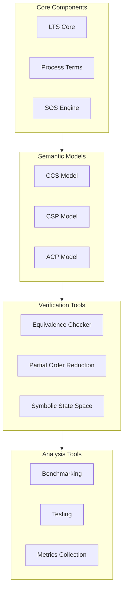
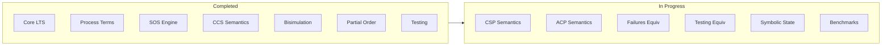

# Process Algebra Verifier

A TypeScript implementation of process algebra verification tools supporting CCS, CSP, and ACP semantics.

## System Overview



## Features

- Support for CCS, CSP, and ACP semantic models
- Multiple behavioral equivalence checking algorithms
- State space reduction techniques
- Symbolic state space representation
- Comprehensive testing and benchmarking tools

## Implementation Status



## Development

### Prerequisites

- Node.js >= 14
- TypeScript >= 4.5

### Setup

```bash
npm install
```

### Build

```bash
npm run build
```

### Test

```bash
npm test
```

### Benchmarks

```bash
npm run benchmark
```

## Documentation

Detailed documentation is available in the following files:

- [Theory and Semantic Models](docs/theory.md)
- [Architecture Details](docs/architecture.md)
- [Examples and Use Cases](docs/examples.md)
- [Implementation Guide](docs/index.md)

## Contributing

Please read our contributing guidelines before submitting pull requests.

## License

This project is licensed under the MIT License - see the LICENSE file for details.
