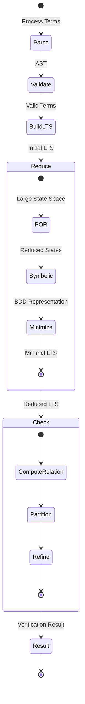
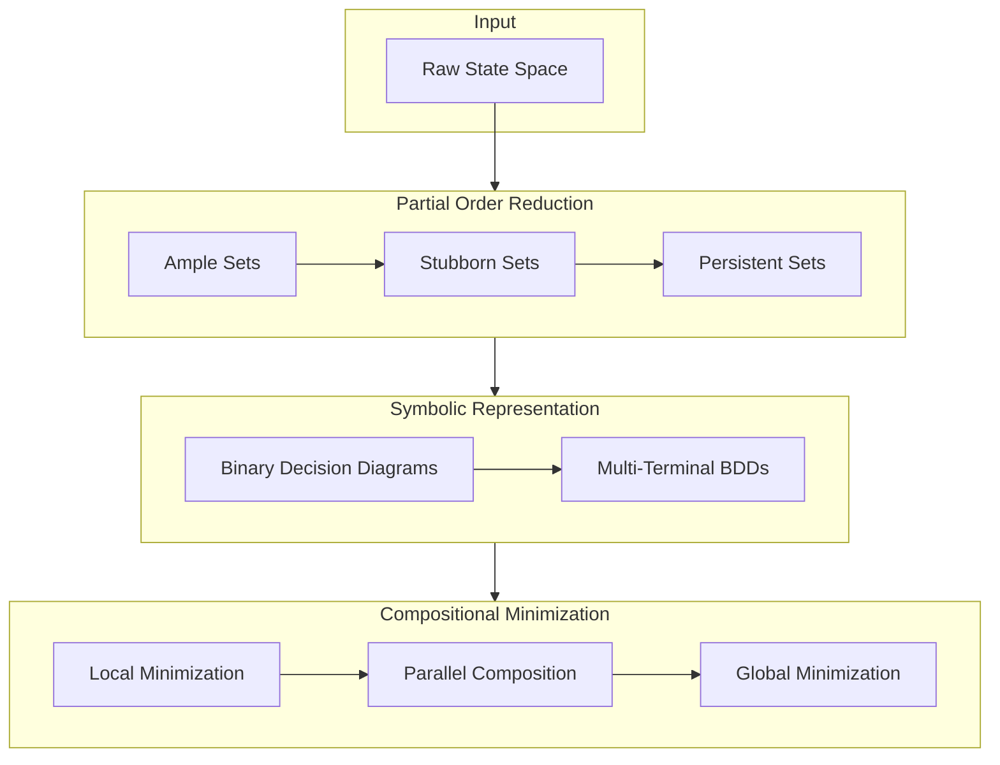
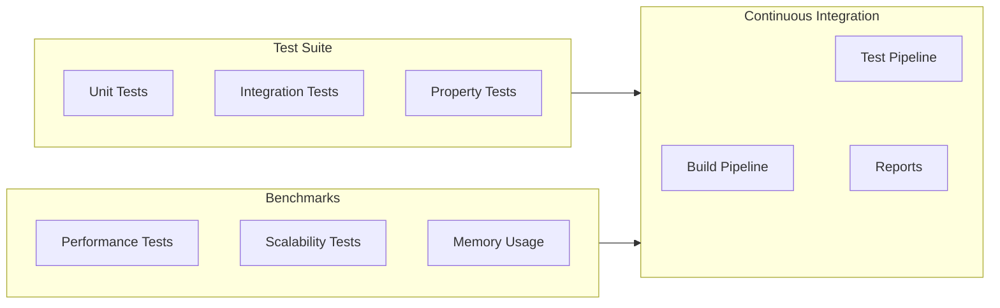
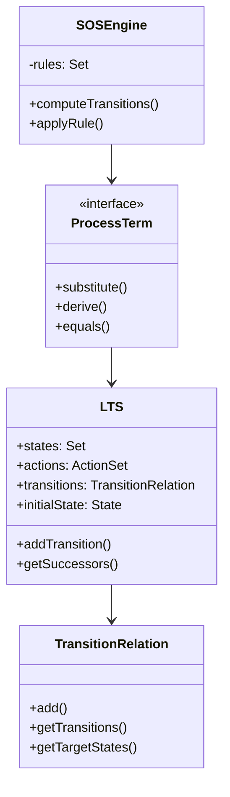
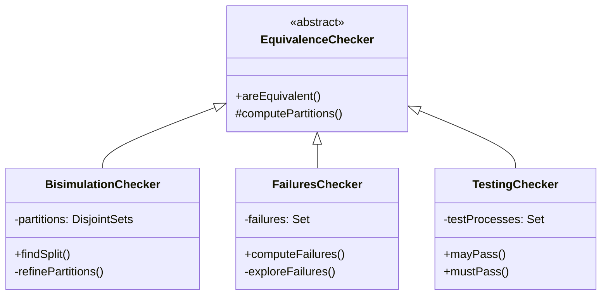
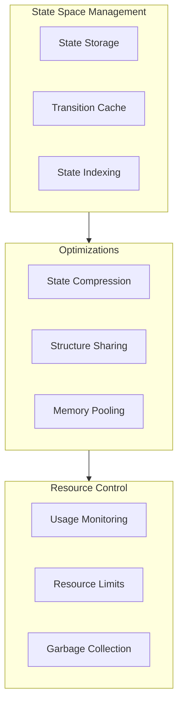
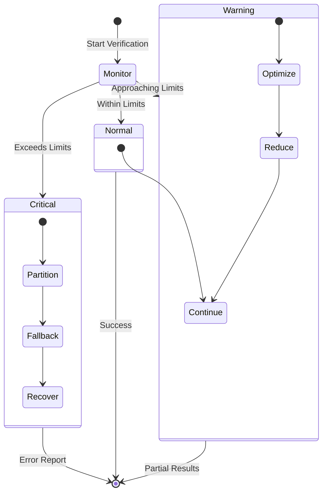
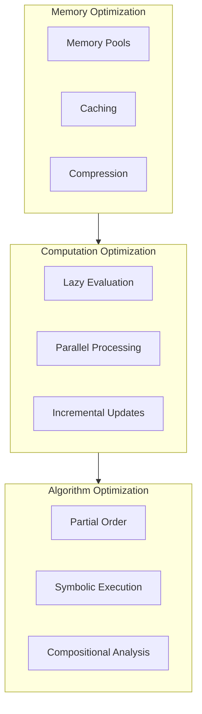

# Process Algebra Verifier Architecture

This document provides detailed architectural diagrams and explanations of the Process Algebra Verifier system.

## Verification Workflow Details



## State Space Reduction Pipeline



## Testing and Benchmarking Infrastructure



## Semantic Models Comparison

```mermaid
graph TB
    subgraph CCS[CCS Model]
        CCS_Sync[Binary Synchronization]
        CCS_Choice[Mixed Choice]
        CCS_Par[Parallel]
    end

    subgraph CSP[CSP Model]
        CSP_Sync[Multiway Synchronization]
        CSP_Choice[External/Internal Choice]
        CSP_Par[Parallel with Alphabet]
    end

    subgraph ACP[ACP Model]
        ACP_Sync[Communication Function]
        ACP_Merge[Merge Operator]
        ACP_Left[Left Merge]
    end

    CCS_Sync --> CSP_Sync: Generalizes to
    CSP_Sync --> ACP_Sync: Abstracts to

    CCS_Choice --> CSP_Choice: Splits into
    CSP_Choice --> ACP_Merge: Combines with

    CCS_Par --> CSP_Par: Adds alphabet
    CSP_Par --> ACP_Merge: Generalizes to
```

## Implementation Components

### Core Components



### Verification Components



## State Space Management



## Error Handling and Recovery



## Performance Optimization Strategies



These architectural diagrams provide a comprehensive view of the system's structure, components, and their interactions. They serve as a guide for both implementation and maintenance of the Process Algebra Verifier.
