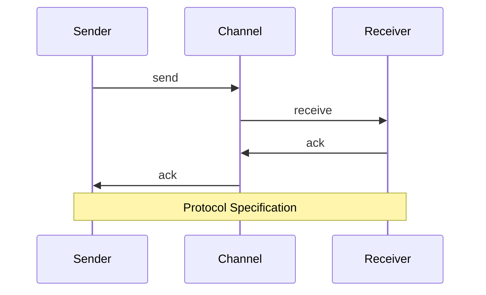
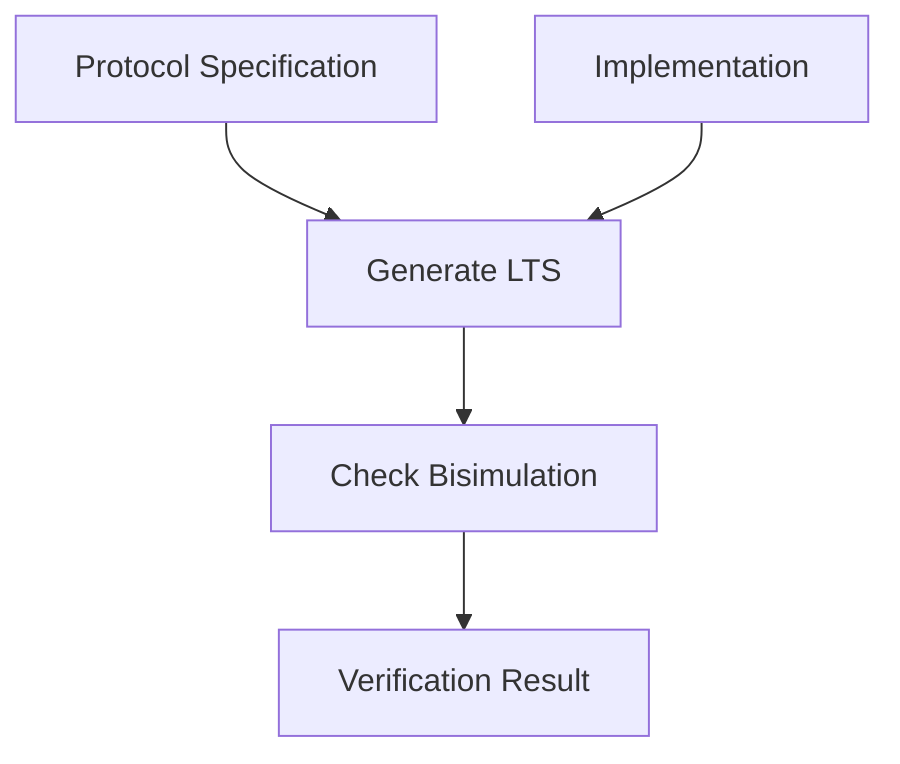
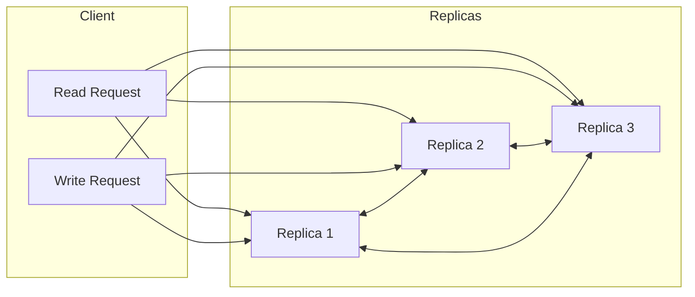
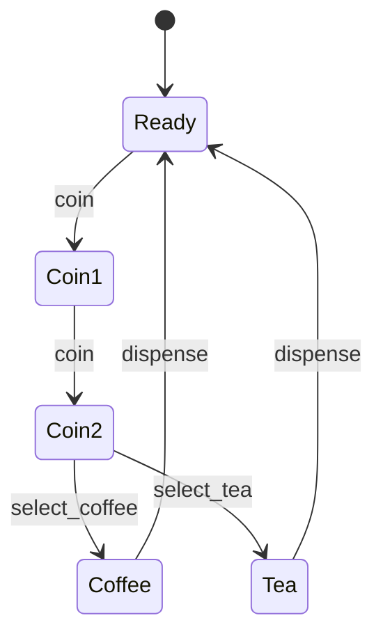
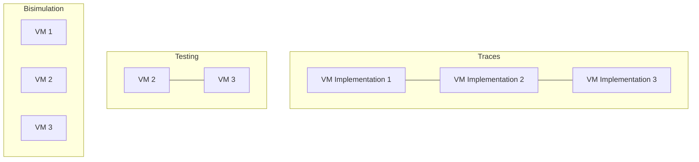
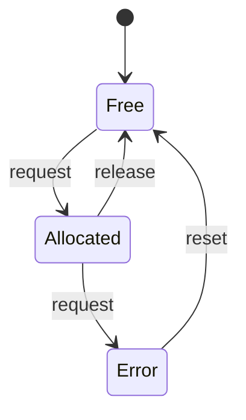
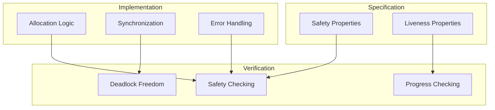
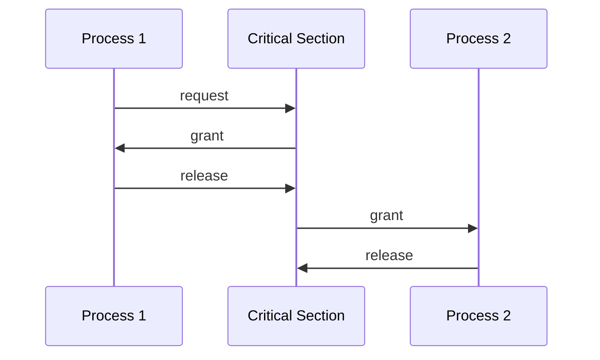
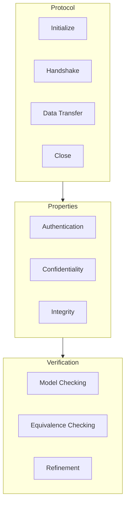

# Process Algebra Examples and Use Cases

This document provides practical examples and visualizations of common process algebra verification scenarios.

## Simple Protocol Verification



### CCS Implementation

```
Sender = send.ack.Sender
Channel = send.receive.ack.ack.Channel
Receiver = receive.ack.Receiver
System = (Sender | Channel | Receiver) \ {send, receive, ack}
```

### Verification Flow



## Distributed Database Example



### CSP Implementation

```
Client = (read?x -> response!x -> Client) [] (write?x -> ack -> Client)
Replica = (read!data -> Replica) [] (write?x -> sync!x -> Replica)
System = (Client [|{read, write}|] Replica) \ {sync}
```

## Vending Machine Example



### ACP Implementation

```
VM = coin.coin.(coffee.VM + tea.VM)
```

### Equivalence Classes



## Resource Allocation System



### Implementation and Verification



## Mutual Exclusion Example



### CCS Implementation

```
Process = request.enter.critical.exit.release.Process
Mutex = request.grant.release.Mutex
System = (Process | Mutex) \ {request, grant, release}
```

## Network Protocol Verification



## Usage Examples

### Basic Verification

```typescript
// Define processes
const spec = parser.parse("coin.coin.(coffee.STOP + tea.STOP)");
const impl = parser.parse("coin.coin.coffee.STOP + coin.coin.tea.STOP");

// Check equivalence
const checker = new BisimulationChecker();
const result = checker.areEquivalent(spec, impl);
```

### Advanced Analysis

```typescript
// Define system with partial order reduction
const system = new VerificationSystem({
  reduction: "partial-order",
  equivalence: "weak-bisimulation",
  maxStates: 10000,
});

// Verify properties
const result = await system.verify(spec, impl, {
  checkDeadlocks: true,
  checkLiveness: true,
});
```

These examples demonstrate common verification scenarios and how to use the process algebra verifier to model and verify concurrent systems. Each example includes:

1. Visual representation of the system
2. Process algebra implementation
3. Verification approach
4. Example code

The examples progress from simple to complex scenarios, showing how different features of the verifier can be combined to handle various verification tasks.
