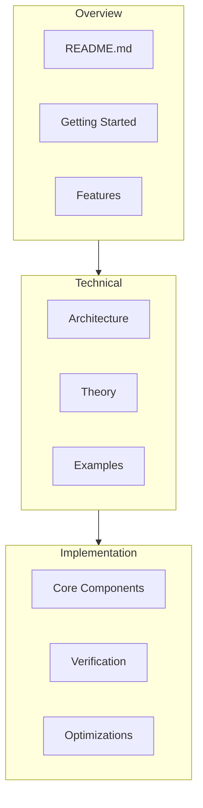
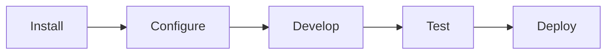
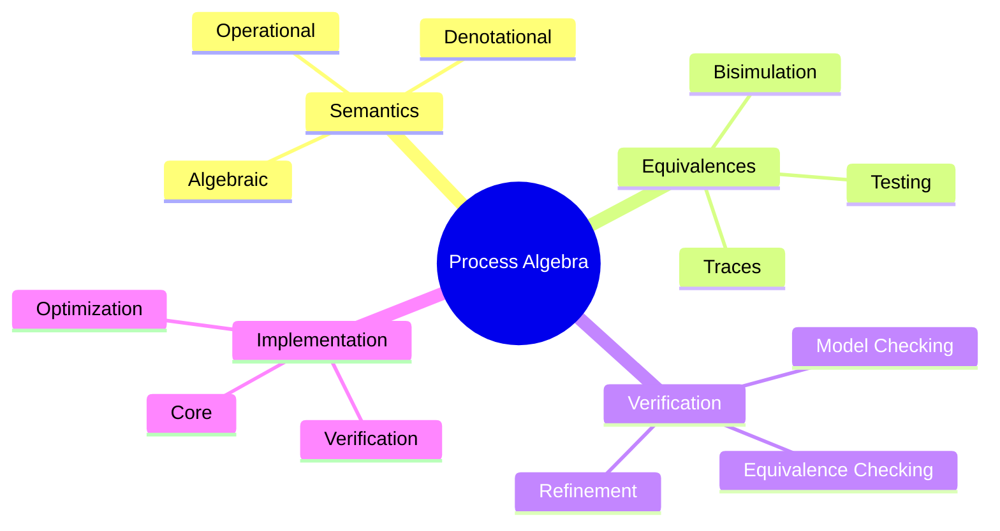
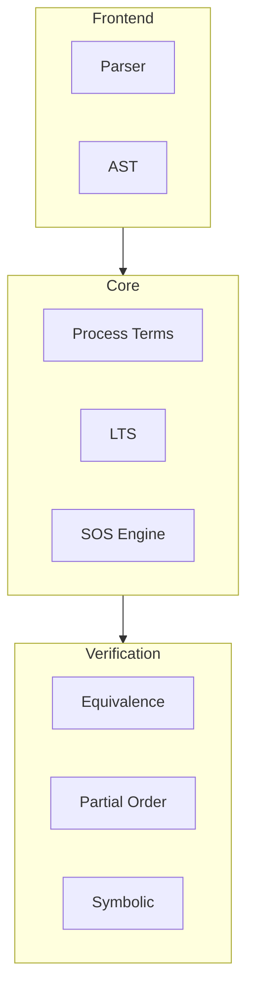
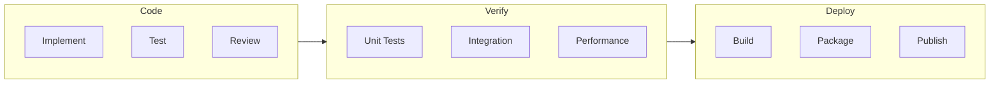
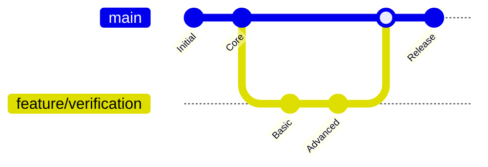

# Process Algebra Verifier Documentation

## Documentation Structure

### [README.md](../README.md)

- Project overview
- Basic architecture
- Feature list
- Setup instructions
- Development guidelines

### [Architecture](architecture.md)

- Detailed system architecture
- Component interactions
- Implementation details
- Performance considerations
- Error handling

### [Theory](theory.md)

- Process algebra foundations
- Semantic models
- Behavioral equivalences
- Verification methods
- Theoretical properties

### [Examples](examples.md)

- Practical use cases
- Implementation patterns
- Verification scenarios
- Code examples
- Visual explanations

## Quick Start

## Core Concepts Map

## Component Dependencies

## Development Workflow

## Navigation Guide

### For New Users

1. Start with [README.md](../README.md) for project overview
2. Review [Examples](examples.md) for practical usage
3. Follow setup instructions to get started

### For Developers

1. Study [Architecture](architecture.md) for system design
2. Review [Theory](theory.md) for foundational concepts
3. Use examples as implementation reference

### For Contributors

1. Follow development workflow
2. Review coding standards
3. Run test suite
4. Submit pull requests

## Additional Resources

### Implementation References

- [Process Term Tests](../tests/core/process-term.test.ts)
- [LTS Implementation](../src/core/lts.ts)
- [Equivalence Checker](../src/verification/equivalence-checker.ts)

### Example Implementations

- [Distributed Database](../examples/distributed-db.ts)
- [Simple Protocol](../examples/simple-protocol.ts)

### Test Cases

- [Core Tests](../tests/core/)
- [Integration Tests](../tests/semantics/)
- [Performance Tests](../tests/benchmarks/)

## Version History

This index provides a comprehensive overview of the documentation structure and helps navigate between different aspects of the Process Algebra Verifier system. Use the links to navigate to specific sections of interest.
