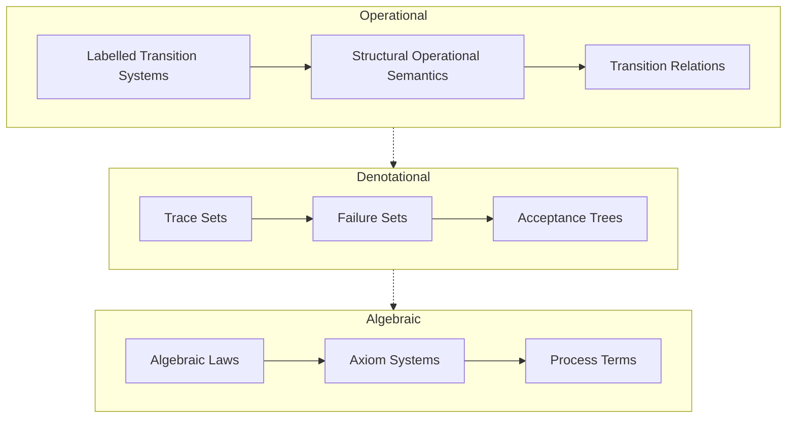
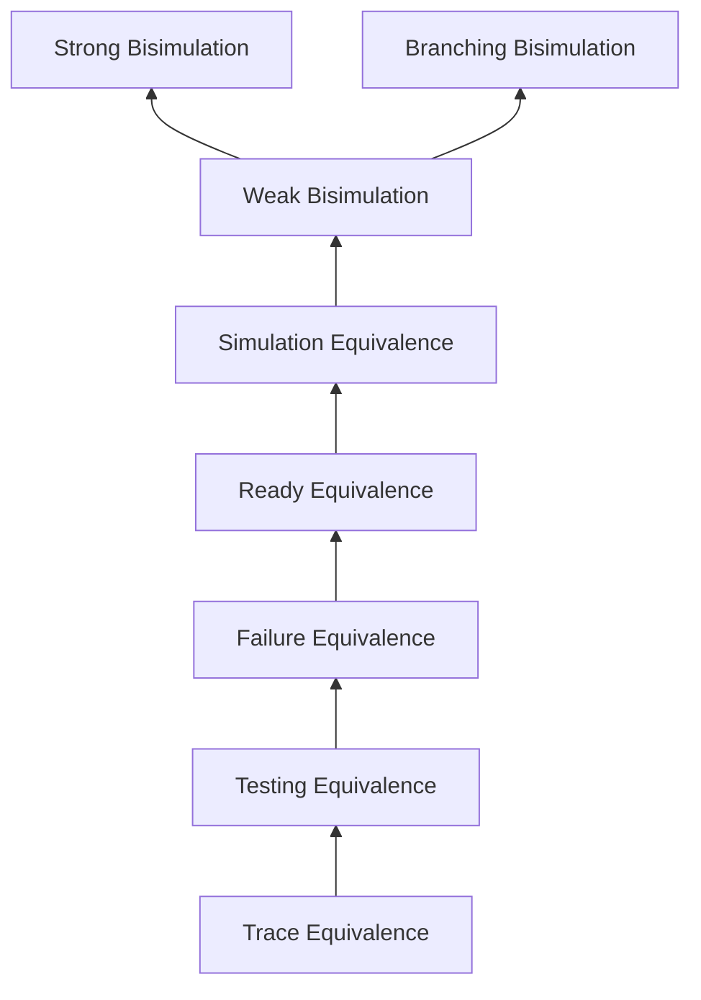
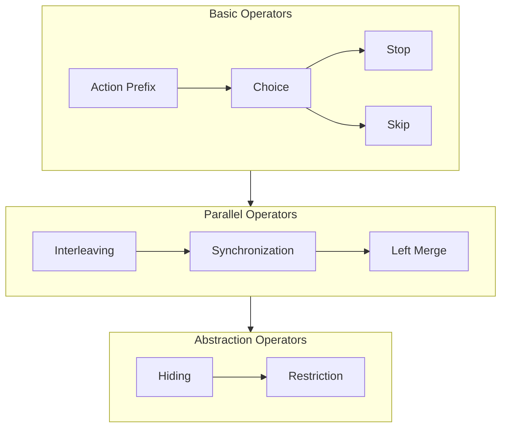
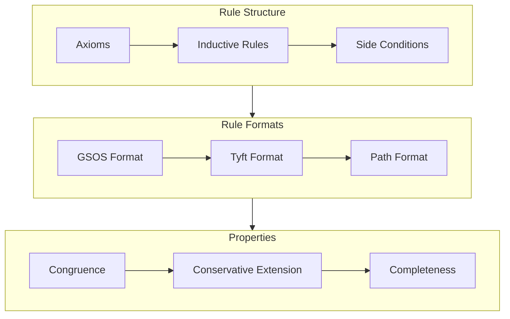
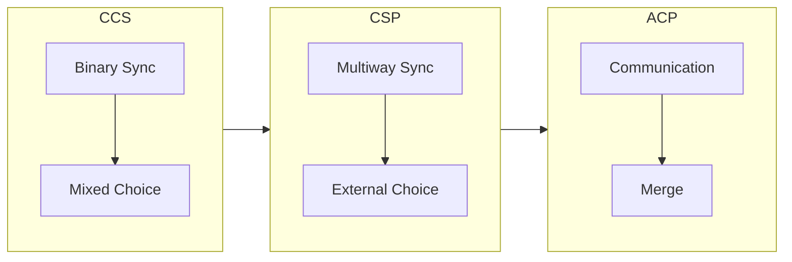
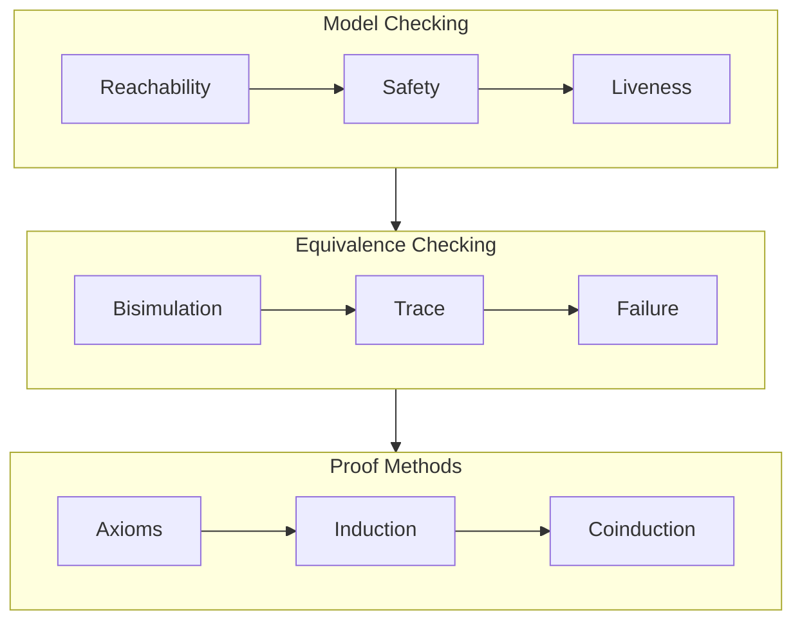
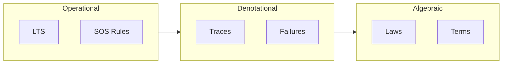
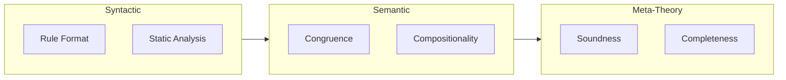
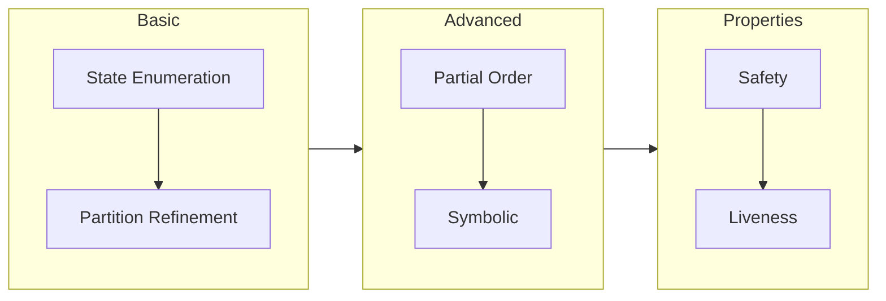

# Process Algebra Theory and Semantic Models

This document provides visualizations of the theoretical foundations and relationships between different process algebra concepts.

## Process Algebra Semantic Domains

## Behavioral Equivalences Hierarchy

## Process Operators

## Semantic Rules

## Process Algebra Models

## Verification Methods

## Semantic Models

## Theoretical Properties

## Verification Techniques

## Key Insights

1. The semantic domains (operational, denotational, algebraic) provide different but complementary views of process behavior.
2. Behavioral equivalences form a hierarchy with increasing discriminative power.
3. Process operators can be classified based on their role in system description.
4. SOS rules and their formats determine important theoretical properties.
5. Different process algebra models (CCS, CSP, ACP) emphasize different aspects of concurrent system description.
6. Verification methods combine different approaches for comprehensive system analysis.

This theoretical foundation guides the implementation of the process algebra verifier, ensuring that the practical tools correctly reflect the mathematical theory.
