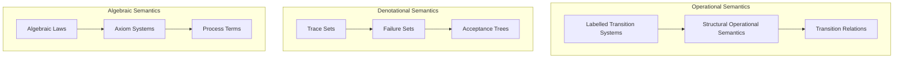
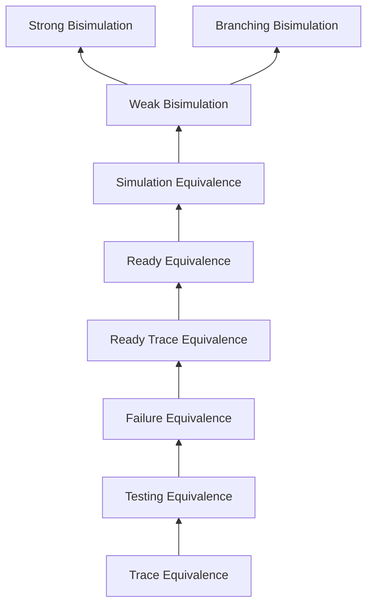
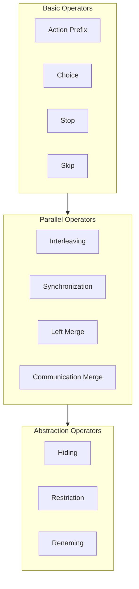
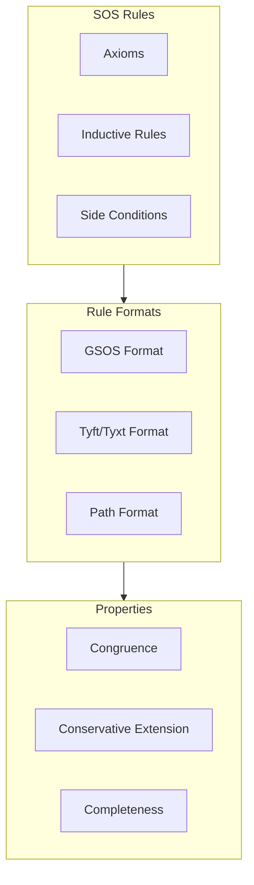
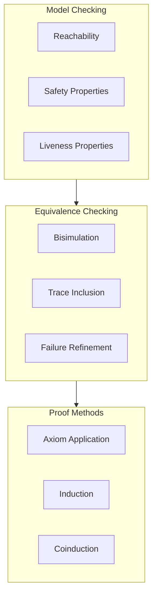

# Process Algebra Theory and Semantic Models

This document provides visualizations of the theoretical foundations and relationships between different process algebra concepts.

## Process Algebra Semantic Domains



## Behavioral Equivalences Lattice



## Process Operators and Their Properties



## Semantic Rules Structure



## Process Algebra Models Comparison

```mermaid
graph LR
    subgraph CCS[CCS Features]
        CCS_Sync[Binary Synchronization]
        CCS_Choice[Mixed Choice]
        CCS_Rec[Recursion]
    end

    subgraph CSP[CSP Features]
        CSP_Multi[Multiway Sync]
        CSP_Choice[External/Internal Choice]
        CSP_Ref[Refusal Sets]
    end

    subgraph ACP[ACP Features]
        ACP_Comm[Communication Function]
        ACP_Merge[Merge Operators]
        ACP_Axioms[Equational Theory]
    end

    CCS --> CSP: Influences
    CSP --> ACP: Influences
```

## Verification Methods



## Semantic Models Relationships

```mermaid
graph TB
    subgraph Operational[Operational]
        LTS[LTS]
        SOS[SOS Rules]
    end

    subgraph Denotational[Denotational]
        Trace[Trace Sets]
        Fail[Failure Sets]
    end

    subgraph Algebraic[Algebraic]
        Law[Laws]
        Term[Terms]
    end

    LTS --> Trace: Abstracts to
    SOS --> Law: Induces
    Trace --> Term: Represents
    Fail --> Term: Represents
    Law --> LTS: Models
```

## Theoretical Properties

```mermaid
graph TB
    subgraph Syntax[Syntactic Properties]
        Format[Rule Format]
        Static[Static Analysis]
    end

    subgraph Semantic[Semantic Properties]
        Congr[Congruence]
        Comp[Compositionality]
    end

    subgraph Meta[Meta-Theory]
        Sound[Soundness]
        Complete[Completeness]
    end

    Format --> Congr: Ensures
    Static --> Comp: Verifies
    Congr --> Sound: Contributes to
    Comp --> Complete: Supports
```

## Verification Techniques Relationships

```mermaid
graph LR
    subgraph Basic[Basic Techniques]
        Enum[State Enumeration]
        Part[Partition Refinement]
    end

    subgraph Advanced[Advanced Techniques]
        POR[Partial Order Reduction]
        Symb[Symbolic Methods]
        Comp[Compositional Methods]
    end

    subgraph Properties[Property Classes]
        Safety[Safety]
        Live[Liveness]
        Fair[Fairness]
    end

    Basic --> Advanced: Enhances
    Advanced --> Properties: Verifies
```

These diagrams provide a comprehensive visualization of the theoretical foundations underlying process algebras and their relationships. They serve as a reference for understanding the mathematical concepts and their practical implementation in the verification system.

## Key Insights

1. The semantic domains (operational, denotational, algebraic) provide different but complementary views of process behavior.
2. Behavioral equivalences form a lattice structure with increasing discriminative power.
3. Process operators can be classified based on their role in system description.
4. SOS rules and their formats determine important theoretical properties.
5. Different process algebra models (CCS, CSP, ACP) emphasize different aspects of concurrent system description.
6. Verification methods combine different approaches for comprehensive system analysis.

This theoretical foundation guides the implementation of the process algebra verifier, ensuring that the practical tools correctly reflect the mathematical theory.
